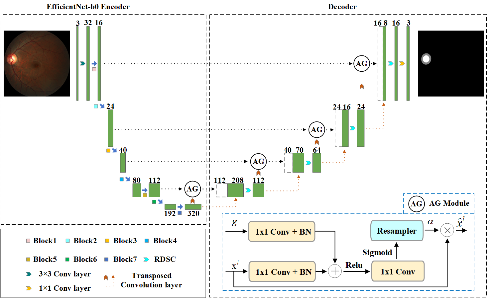

# :page_facing_up: EARDS: EfficientNet and Attention-based Residual Depth-wise Separable Convolution for Joint OD and OC Segmentation

<p align="center"></p>

### Dependency Preparation

```shell
cd EARDS
# Python Preparation
conda create -n EARDS python=3.7
activate EARDS
# (torch 1.10.0+cu102) It is recommended to use the conda installation on the Pytorch website https://pytorch.org/
pip install -r requirements.txt
```

### Model Training and Inference

```shell
# Model Train
# Please set the path of training image, training label in Train.py file.
python Train.py
# Model Test
# Please set the path of test image, test label, output image and checkpoint in test.py file.
python test.py
```

### Citation ✏️ 📄

If you find this repo useful for your research, please consider citing the paper as follows:

```
@article{zhou17eards,
title={EARDS: EfficientNet and Attention-based Residual Depth-wise Separable Convolution for Joint OD and OC Segmentation},
author={Zhou, Wei and Ji, Jianhang and Jiang, Yan and Wang, Jing and Qi, Qi and Yi, Yugen},
journal={Frontiers in Neuroscience},
volume={17},
pages={282},
publisher={Frontiers}
}
```
